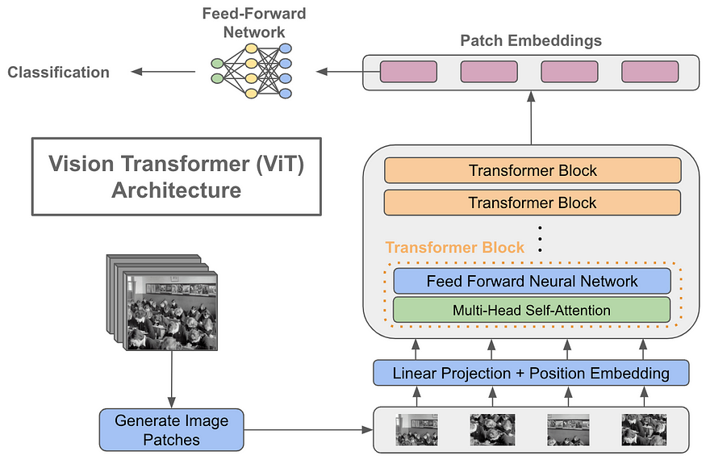
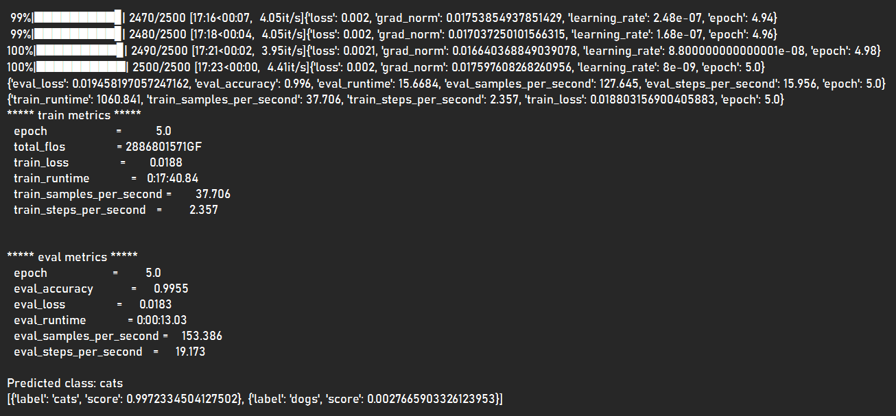

# ViT_ObjectClassification: Image Classification using Visual Trasformers(ViT)

## Introduction

This is a PyTorch **ViT_ObjClassification** implementation based the hugging face ViTImageClassification and **An Image is Worth 16x16 Words: Transformers for Image Recognition at Scale** paper by Alexey Dosovitskiy et.al.(https://arxiv.org/abs/2010.11929). The implementation uses a custom hugging face image dataset loaded from the local disk.

This implementation fine tunes googles "google/vit-base-patch16-224-in21k" pre-trained model on ImageNet-21k (14 million images, 21,843 classes) at resolution 224x224geNet. There are "google/vit-base-patch32-224-in21k" (with 32 patches/image of size 224x224) and "google/vit-base-patch32-384" (with 32 patches/image of size 384x384) versions available. 

Images are presented to the model as a sequence of fixed-size patches (resolution 16x16), which are linearly embedded.

The dataset used is the Oxford Cats and Dogs from Kaggle (https://www.kaggle.com/datasets/karakaggle/kaggle-cat-vs-dog-dataset). The dataset has 2 classes (cats and dogs). The dataset has below structure :

CnDs  (folder structure is important)
..|  
..|- train  
..|...|- cats  
..|...|..L "cat images.jpg"  
..|...L dogs  
..|......L "dog images.jpg"  
..L test  
.....|- cats  
.....|..L "cat images.jpg"  
.....L dogs  
........L "dog images.jpg"  

The Visual Transformer Architecture is as below :  
   

The training and evaluation snapshot of the model is as below :  
   

## Author : Kuljeet Singh